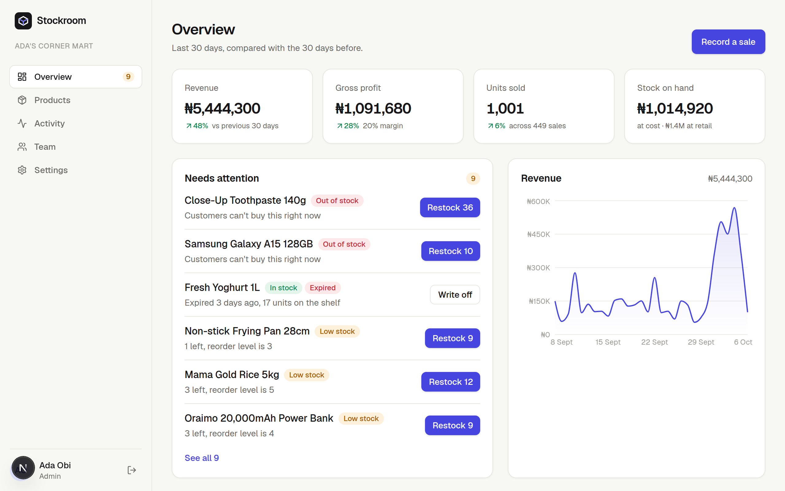
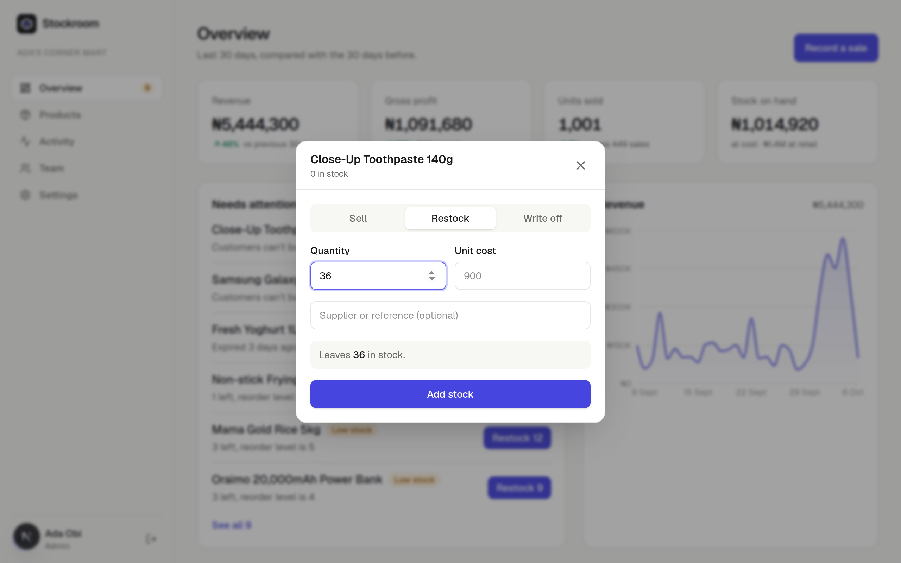
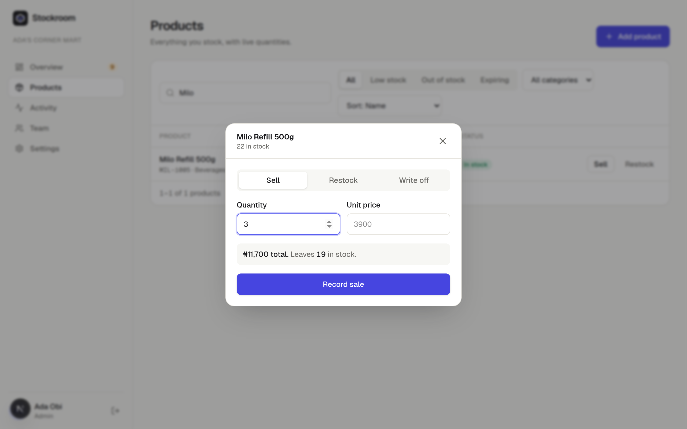
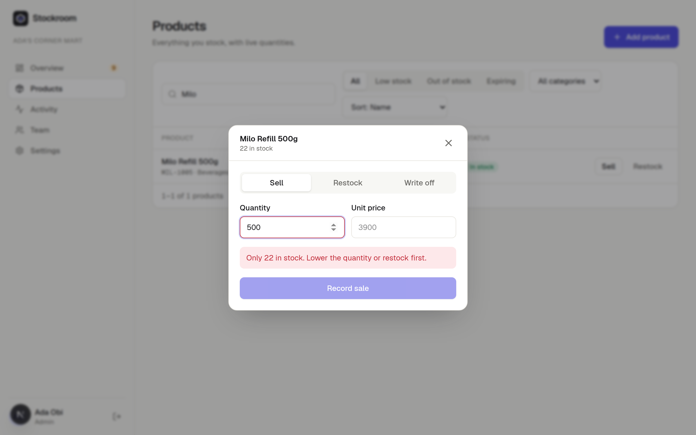
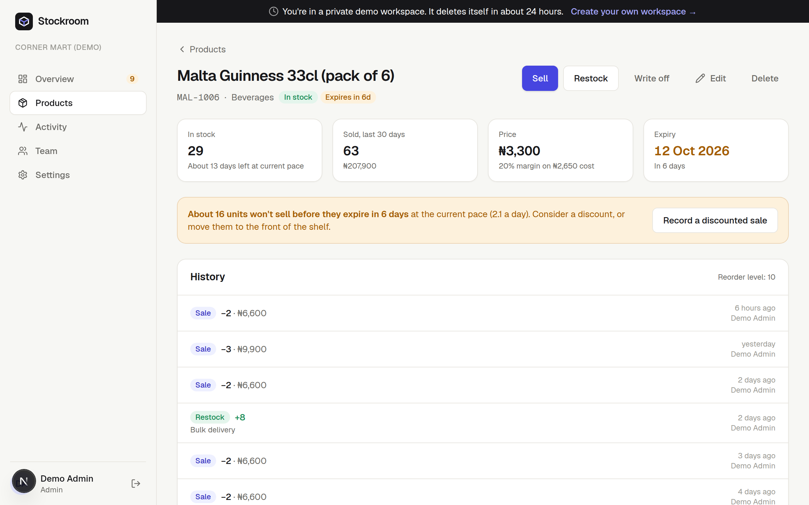
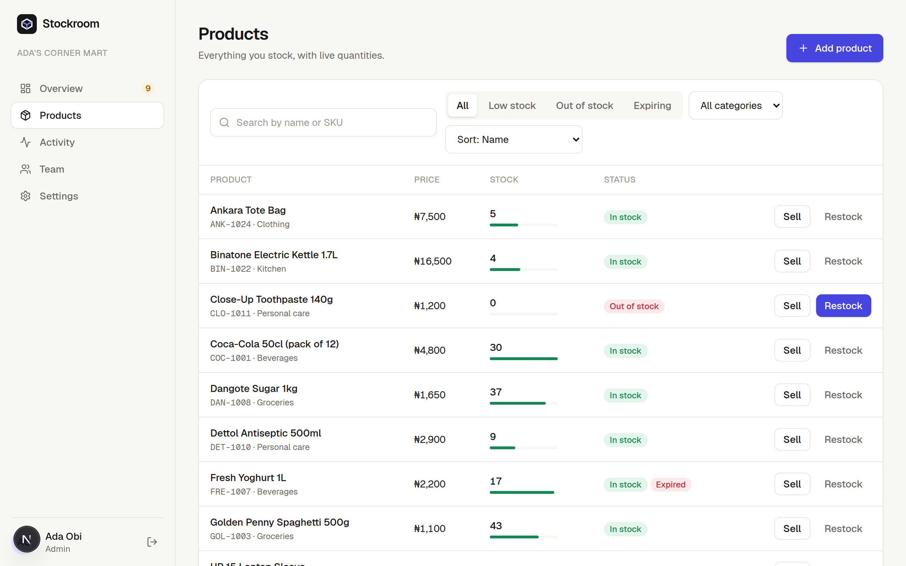
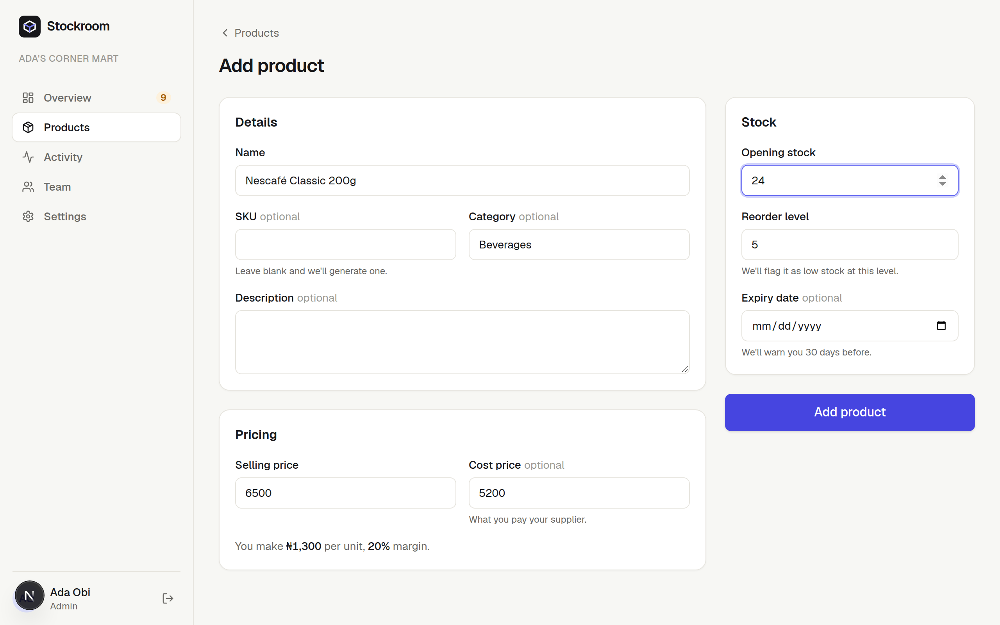
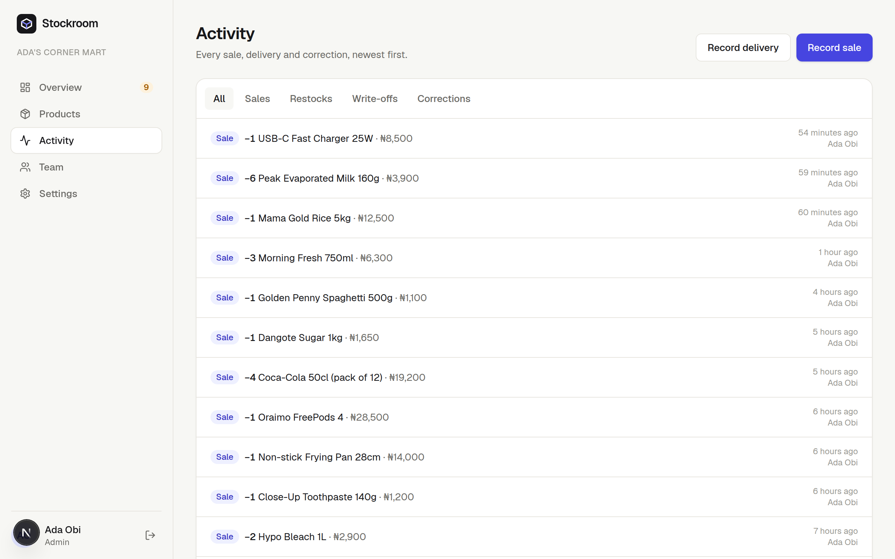
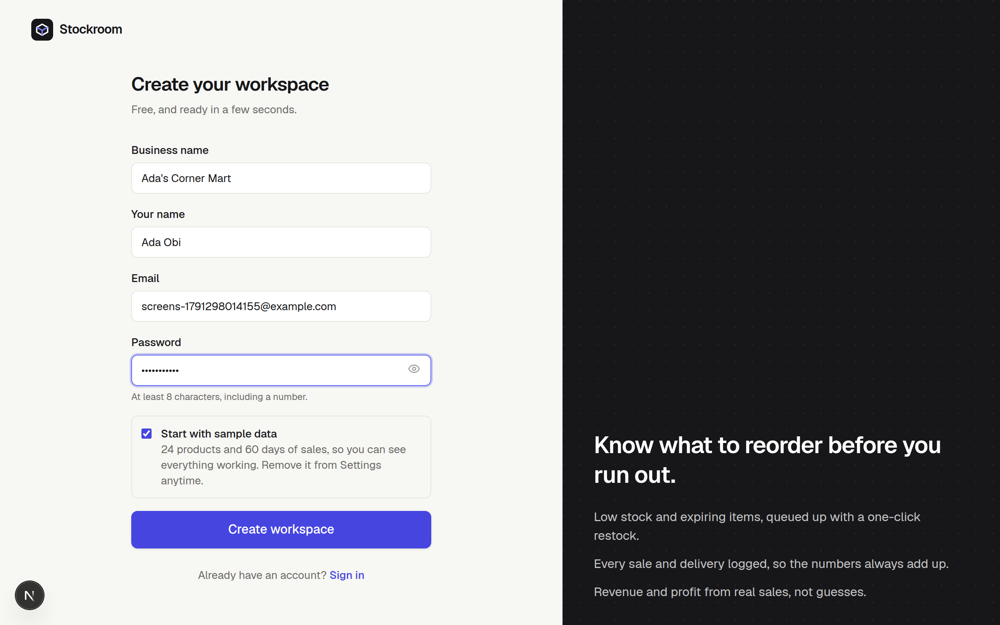
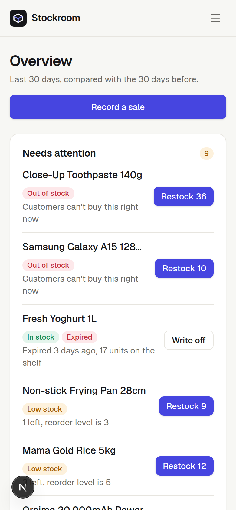

# Stockroom

**Inventory that tells you what to do next.** Stockroom tracks stock, sales and expiry dates for shops, pharmacies and small warehouses. Instead of a wall of numbers, it opens on a short queue of things that need you today, each with the fix one click away.

**[Try the live demo →](https://fullstack-next14-inventory-mgt-app.vercel.app)**. One click gives you a private workspace with 60 days of sample trading. It deletes itself after 24 hours.



**Stack:** Next.js 16 (App Router, Server Actions) · React 19 · Tailwind CSS 4 · MongoDB / Mongoose 9 · Zod 4 · jose · Recharts · Node 24

---

## Product decisions

Inventory tools usually fail in the same way: they record everything and tell you nothing. Every screen here answers *"what should I do?"* before *"what happened?"*.

| Moment | Decision | Why |
| --- | --- | --- |
| Opening the app | **A "Needs attention" queue leads the overview:** out of stock, then expired, then low, then expiring, each with a single action ("Restock 36", "Write off"). Restock quantities are suggested. | A dashboard of charts makes you hunt for problems. A ranked to-do list with the fix attached turns ten seconds of attention into done work. |
| Before recording a sale | **The dialog shows the consequence first:** the total, what will be left, and a warning if that drops below the reorder level. | People make better calls when they see the outcome before they commit, not after. |
| Selling more than you have | **Blocked as you type** ("Only 20 in stock. Lower the quantity or restock first."), and again **atomically on the server** (`findOneAndUpdate` with `stock >= qty`), so two people can't sell the last unit. | Never let a user create a state the business can't actually be in. |
| Reading a product | **Runway, not just a count:** "42 in stock · about 7 days left at current pace". | "42" means nothing on its own. "7 days" tells you when to reorder. |
| Perishables | **Waste is predicted, not just dated:** "About 16 units won't sell before they expire in 6 days. Consider a discount." with a one-click discounted sale. | An expiry date is a fact. "You'll throw away 16" is a decision. |
| Pricing a product | **Live margin while typing:** "You make ₦1,300 per unit, 20% margin". Red if you'd lose money. | Catch the mispriced item at the moment it's created. |
| Changing a count by hand | **The form asks "Why is the count changing?"** and logs it. Sales and deliveries go through their own actions. | Every unit is accounted for. The ledger always sums to the shelf. |
| Comparisons | **Honest deltas:** "↑ 18% vs previous 30 days", or "No earlier sales to compare" when there's no baseline. | A fake "+55%" teaches users to ignore the number. |
| Getting started | **Sign-up asks for four things**, and "Start with sample data" comes pre-ticked. Sample data is flagged, and removable in one click from Settings. | An empty dashboard can't show its value. Sample data shows it in seconds, and removing it is just as easy. |
| Trying it | **"Try the live demo" creates a private sandbox** that deletes itself after 24 hours (MongoDB TTL indexes), with a banner showing the time left and a link to create a real workspace. | Visitors can push every button without breaking a shared demo, and the expiry gives a gentle nudge to sign up. |
| Destructive actions | **Confirmations name the consequence:** "Its past sales stay in Activity so your revenue history still adds up." | People hesitate over deletes because they don't know what else breaks. Telling them removes the doubt. |
| On a phone | **The attention queue comes before the KPIs.** Tables become cards. | On a small screen, show the thing to act on first. |

## Walkthrough

<table>
  <tr>
    <td width="50%"><br><sub>Restock straight from the queue, with a suggested quantity.</sub></td>
    <td width="50%"><br><sub>The consequence of a sale, shown before you commit.</sub></td>
  </tr>
  <tr>
    <td><br><sub>You can't sell what isn't there.</sub></td>
    <td><br><sub>Runway and predicted waste, not just numbers.</sub></td>
  </tr>
  <tr>
    <td><br><sub>Search, status filters and sorting live in the URL.</sub></td>
    <td><br><sub>Margin calculated as you type.</sub></td>
  </tr>
  <tr>
    <td><br><sub>Every sale, delivery, write-off and correction, with who did it.</sub></td>
    <td><br><sub>Four fields, with sample data on by default.</sub></td>
  </tr>
</table>

<p align="center"></p>

## Features

- **Workspaces and roles:** each sign-up gets its own workspace. Admins manage the team, settings and deletions; staff sell, restock and edit products. Every query is scoped to the workspace.
- **Products:** SKU (auto-generated if blank), category, price, cost, stock, reorder level, optional expiry date. Search, filter by status (low, out, expiring), filter by category, sort, paginate.
- **Stock movements:** sales, restocks, write-offs and corrections, with user and price snapshots so history survives renames and deletes.
- **Overview:** revenue, gross profit, units sold and stock value (at cost and retail) for the last 30 days vs the 30 before, a daily revenue chart, top sellers and recent activity.
- **Team:** add members with a temporary password, change roles (a workspace always keeps one admin), remove members.
- **Settings:** workspace name, currency (NGN, USD, GBP, EUR, KES, GHS, ZAR), load or remove sample data.

## Run it locally

Requires **Node 22+** (Node 24 LTS recommended) and MongoDB. The app lives in [`web/`](web).

```bash
cd web
cp .env.example .env        # set MONGODB_URI and AUTH_SECRET
npm install
npm run dev                 # http://localhost:3000
```

Then click **Try the live demo**, or create a workspace with sample data.

**With Docker** (includes MongoDB):

```bash
echo "AUTH_SECRET=$(node -e "console.log(require('crypto').randomBytes(32).toString('base64url'))")" > .env
docker compose up --build   # http://localhost:3000
```

| Variable | Purpose |
| --- | --- |
| `MONGODB_URI` | MongoDB connection string, e.g. `mongodb+srv://…/stockroom` |
| `AUTH_SECRET` | Signs session cookies. At least 32 random characters. |

**Deploying to Vercel:** set Root Directory to `web`, Node.js to 24.x, and add the two variables above.

## How it works

```
web/src/
  proxy.js              optimistic auth redirect (Next 16's replacement for middleware)
  lib/
    session.js          signed, httpOnly session cookie (jose, HS256)
    dal.js              data access layer: verifies the session against the DB on every request
    models.js           Workspace, User, Product, Movement (+ TTL indexes for demos)
    queries.js          workspace-scoped reads and dashboard aggregations
    sample-data.js      60-day trading simulation whose ledger sums to current stock
    validation.js       Zod schemas shared by every form
  actions/              server actions: auth, products, team, settings
  app/                  routes: landing, login, register, dashboard/*
  components/           StockDialog, ProductForm, RevenueChart, toasts, …
```

- **Auth** follows the Next.js 16 guide. `proxy.js` does a cheap cookie check for redirects, and **every page and server action re-verifies** through `lib/dal.js`, which loads the user and workspace from the database. A deleted user or an expired demo is locked out immediately. Passwords are hashed with bcrypt, login errors don't reveal which emails exist, and the post-login `next` redirect only allows internal `/dashboard` paths.
- **Authorisation:** server actions are public HTTP endpoints, so each checks the session and role itself and scopes every read and write by `workspace`. One workspace can't read or change another's data, even with the exact product URL.
- **Stock integrity:** quantities only change through `$inc` updates guarded by `stock >= qty`, and each change writes a `Movement`. The dashboard reports revenue and profit by aggregating that ledger.
- **Demo sandboxes:** workspace, user, products and movements carry the same `expiresAt`, and MongoDB's TTL monitor removes them together. Demo creation is rate-limited.
- **UI:** the confirmation toast lives in a tiny external store, so it survives the component that raised it unmounting (e.g. a restocked item leaving the attention queue).

## What changed from v1

This began as a 2024 Next 14 tutorial project and was rebuilt in October 2026:

- **Security fixes:** login never checked the password; passwords were stored in plain text; anyone could register as Admin; server actions had no auth checks; `.env` and the database password were committed.
- **Bug fixes:** product descriptions never saved; nested `<html>` in the dashboard layout; unawaited deletes; unescaped regex search; two items per page.
- **Placeholders replaced with real features:** a dummy dashboard, a "Sales" stub and a template landing page became the ledger, real reports, the attention queue, roles, sample data and the demo.
- **Platform:** Next 14 → 16, the beta auth library → a small first-party session, Node 20 → 24, Tailwind 3 → 4.

The original v1 code is still in the repository root (`src/`, the old `package.json`) for reference. The current app is entirely in `web/`.
